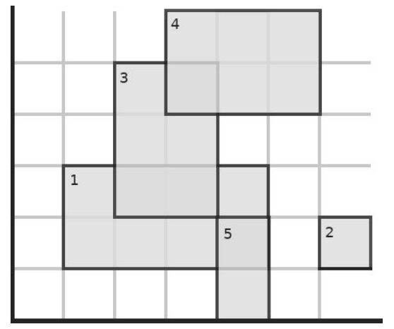

# 2737 矩形

## 题目描述

在二维平面坐标系，**依次**给出 $$n$$ 个矩形。第 $$i$$ 个矩形是“差的”，当且仅当：存在一个 $$j$$，满足 $$i < j \leq n$$，且矩形 $$i$$ 和矩形 $$j$$ 有重叠面积。

## 输入格式

第一行，一个整数 $$n$$。

接下来依次给出 $$n$$ 个矩形的信息，第 $$i$$ 个矩形的信息：$$x_i,\,y_i,w_i,\,h_i$$。$$(x_i,\,y_i)$$ 是矩形左下角的坐标，$$w_i$$ 是矩形的宽度，$$h_i$$ 是矩形的高度。每个矩形的信息一行。

## 输出格式

共 $$n$$ 行，第 $$i$$ 行表示第 $$i$$ 个矩形是否是“差”的。如果是“差的”输出 `NE`，否则输出 `DA`。

## 输入样例 1



```text
5
1 1 4 2
6 1 1 1
2 2 2 3
3 4 3 2
4 0 1 2
```



## 输出样例 1



```text
NE
DA
NE
DA
DA
```



## 输入样例 2



```text
3
3 3 1 1
2 2 3 3
1 1 5 5
```



## 输出样例 2



```text
NE
NE
DA
```



## 样例解释



## 数据范围

$$1 \leq n \leq 10^5$$，所有整数范围为 $$[0,\,10^9]$$。

## 来源

[COCI 2018/2019 Contest \#2 Task Sunčanje​](http://hsin.hr/coci/contest2_tasks.pdf)

