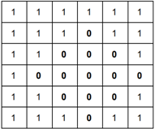
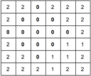
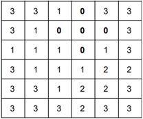

# 2741 小草

## 题目描述

有一个 $$n$$ 行 $$m$$ 列的花园，左上角格子是 $$(1,\,1)$$，右下角格子是 $$(n,\,m)$$。一开始每个格子都有 1 棵小草。每个格子每一天都长 1 棵小草。接下来的 $$k$$ 天，每天都有 1 场暴雨，第 $$i$$ 场暴雨是以 $$(x_i,\,y_i)$$ 为圆心，$$r_i$$ 为半径的圆，在圆内的所有格子的小草全部被毁灭，具体就是：设格子 $$(x,\,y)$$ 满足：$$(x_i - x)^2 + (y_i - y)^2 \leq r_i^2$$，那么格子 $$(x,\,y)$$ 的小草数量会变成 0。 注意：被暴雨毁灭的格子，每天还是会生长出 1 棵小草。第 $$k$$ 天暴雨后，花园的小草的总数量是多少？

## 输入格式

第一行，$$n$$ 和 $$m$$。

第二行，一个整数 $$k$$。

接下来有 $$k$$ 行，第 $$i$$ 行是三个整数：$$x_i,\,y_i,\,r_i$$。

## 输出格式

一个整数。

## 输入样例 1



```text
6 6
3
4 4 2
3 3 2
2 4 1
```



## 输出样例 1



```text
68
```



## 输入样例 2



```text
100 100
2
50 50 49
30 30 29
```



## 输出样例 2



```text
9534
```



## 输入样例 3



```text
33333 44444
1
11111 22222 9999
```



## 输出样例 3



```text
1167355751
```



## 样例解释

对于样例 1：







## 数据范围

$$1 \leq n,\,m \leq 10^5$$，$$1 \leq k \leq 100$$，$$1 \leq x_i \leq n$$，$$1 \leq y_i \leq m$$。$$ 1 \leq r_i \leq \min(x_i - 1,\,y_i - 1,\,n - x_i,\,m - y_i)$$。

对于 20% 的数据，$$1\leq n,\,m \leq 10^3$$。

## 来源

[COCI 2018/2019 Contest \#3 Task NLO](http://hsin.hr/coci/contest3_tasks.pdf)

