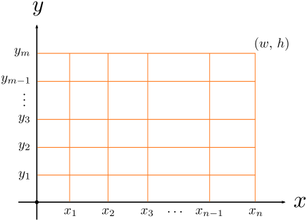

# 2768 询问次数

## 题目描述

如下图所示：



有一个二维表格，$$0 = x_0 < x_1 < x_2 < x_3 < \cdots < x_{n-1} < x_n = w$$，且 $$0 = y_0 < y_1 < y_2 < y_3 < \cdots < y_{m-1} < y_m = h$$。

现在 $$x$$ 具体的值不知道，$$y$$ 具体的值也不知道，$$w$$ 和 $$h$$ 的值也不知道。

但是你想知道 $$w \times h$$ 的结果。注意：$$w$$ 可以是实数，$$h$$ 也可以是实数。

下面的信息会帮助到你。

给出二维数组 `known`：

1. 如果 `known[i][j]` 等于 `Y`，表示以点 $$(x_j,\,y_i)$$ 为左下角，以点 $$(x_{j+1},\,y_{i+1})$$ 为右上角的矩形的面积是已知的，即 $$(x_{j+1} - x_j) \times (y_{i+1} - y_{i-1})$$ 的值是已知的。
2. 如果 `known[i][j]` 等于 `N`，表示以点 $$(x_j,\,y_i)$$ 为左下角，以点 $$(x_{j+1},\,y_{i+1})$$ 为右上角的矩形的面积是未知的，即 $$(x_{j+1} - x_j) \times (y_{i+1} - y_{i-1})$$ 的值是未知的。

显然，虽然给出了 `known` 数组，但有时候还不能确定 $$w \times h$$ 的结果。

现在你可以询问，每次询问你可以选择 $$a$$ 和 $$b$$，询问以点 $$(x_b,\,y_a)$$ 为左下角，以点 $$(x_{b+1},\,y_{a+1})$$ 为右上角的矩形的面积是多少。

每次询问你都能得到正确答案，其中 $$0 \leq a < m$$ 且 $$0 \leq b < n$$。

你至少需要询问多少次，才能知道 $$w \times h$$ 的正确结果？

## 输入格式

多组测试数据。

第一行，一个整数 $$g$$，表示有 $$g$$ 组测试数据。

每组测试数据格式：

第一行，两个整数 $$m$$ 和 $$n$$。

接下来是 $$m$$ 行 $$n$$ 列的二维数组 `known`。

## 输出格式

共 $$g$$ 行，每行一个整数。

## 输入样例



```text
5
2 2
NN
NN

3 3
YNY
NYN
YNY

4 2
YY
YY
YY
YY

1 10
NNNNNNNNNN

5 7
NNYYYNN
NNNNNYN
YYNNNNY
NNNYNNN
YYNNNNY
```



## 输出样例



```text
3
1
0
10
2
```



## 数据范围

$$1 \leq g \leq 10$$，$$1 \leq m,\,n \leq 50$$。

## 来源

[Single Round Match 505 Round 1 Division I RectangleArea](https://community.topcoder.com/stat?c=problem_statement&pm=11400)

