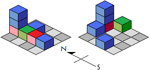
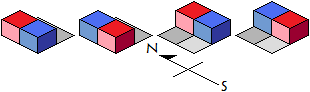

# 2806 建筑物

## 题目描述

有 $$r$$ 红色立方体，$$g$$ 绿色立方体和 $$b$$ 蓝色立方体。每个立方体的边长是 1。现在有一个 $$n \times n$$ 的木板，该板被划分成 $$1 \times 1$$ 个单元。现在要把所有的 $$r + g + b$$ 个立方体都放在木板上。立方体必须放置在单元格内，单元格可以竖立放置多个立方体。

放置在板上的立方体可以被视为“建筑物”。一个“建筑物”被称为“美丽建筑物”，当且仅当：人站在南面，向北面望过去，观察建筑物时，所有可见立方体都是相同的颜色。

例如，在下图中，左侧建筑物是“美丽建筑物”，而右侧建筑物则不是。



问题是：给出 $$r,\,g,\,b,\,n$$ ，有多少种不同的“美丽建筑物”，答案模 $$10^9+7$$ 。

## 输入格式

多组测试数据。

第一行，一个整数 $$g$$ 。表示有 $$g$$ 组测试数据。

每组测试数据格式：

一行，4 个整数：$$r,\,g,\,b,\,n$$。

## 输出格式

共 $$g$$ 行，每行一个整数。

## 输入样例



```text
4
1 0 1 2
1 1 2 1
2 2 1 3
0 0 10 12
```



## 输出样例



```text
4
0
162
372185933
```



## 样例解释

对于第一组测试数据：



## 数据范围

$$1 \leq g \leq 8$$， $$0 \leq r,\,g,\,b < 26$$， $$1 \leq n < 26$$。

