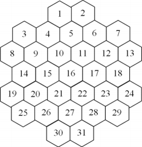
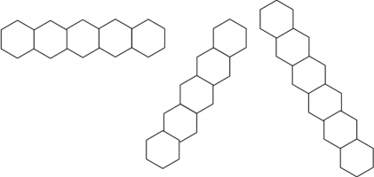
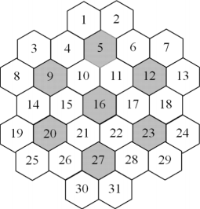
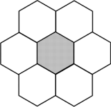
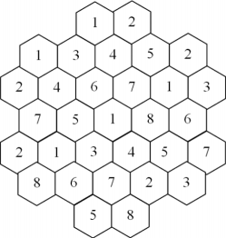

# 2941 数独

## 题目描述

考虑一个不标准的数独模型，它的棋盘如下所示：



格子从 1 到 31 标号。

根据规则，可以往每个格子中填 1 到 $$k$$ 之间的数，每一行中的数都不能相同。

在这个数独中，以下的情况都视为一行（具体见样例解释 1）：



另外地，对于每个深颜色的格子，它和它相邻的格子中的任意一对格子都不能出现填的数编号相同的情况。





有些格子中可能已经填好了数，你要找出字典序第 $$n$$ 小的答案。

保证至少有一组合法解。

## 输入格式

第一行两个整数 $$k,\,n$$，意义见题面。

第二行 31 个整数，依次给出数独中每个格子中的数，若是 0 则表示这一格还未未确定。

## 输出格式

如果存在字典序第 $$n$$ 小的解，输出 `Found`，并且在第二行中输出数独中的每个数。

如果不存在，输出 `No way`。

## 输入样例 1



```text
8 1
0 0 0 0 0 0 0 0 0 0 0 0 0 0 0 0 0 0 0 0 0 0 0 0 0 0 0 0 0 0 0
```



## 输出样例 1



```text
Found
1 2 1 3 4 5 2 2 4 6 7 1 3 7 5 1 8 6 2 1 3 4 5 7 8 6 7 2 3 5 8
```



## 输入样例 2



```text
7 100000
0 0 0 0 0 0 0 0 0 0 0 0 0 0 0 0 0 0 0 0 0 0 0 0 0 0 0 0 0 0 0
```



## 输出样例 2



```text
No way
```



## 输入样例 3



```text
9 10
1 2 0 3 4 5 2 0 4 6 7 1 3 0 5 1 8 6 0 1 3 4 5 0 8 6 7 2 3 5 8
```



## 输出样例 3

```text
Found
1 2 1 3 4 5 2 8 4 6 7 1 3 7 5 1 8 6 2 1 3 4 5 9 8 6 7 2 3 5 8
```

## 样例解释

### 样例 1



## 数据范围

对于 20% 的数据，$$k \leq 7$$

对于另外 20% 的数据，$$n = 1$$

对于另外 20% 的数据，$$k = 31$$

对于 100% 的数据，$$k \leq 31,\,n \leq 10^5$$

