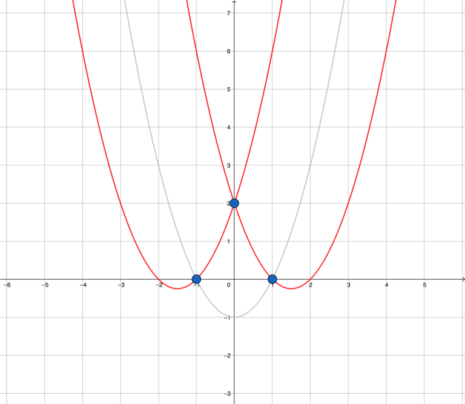
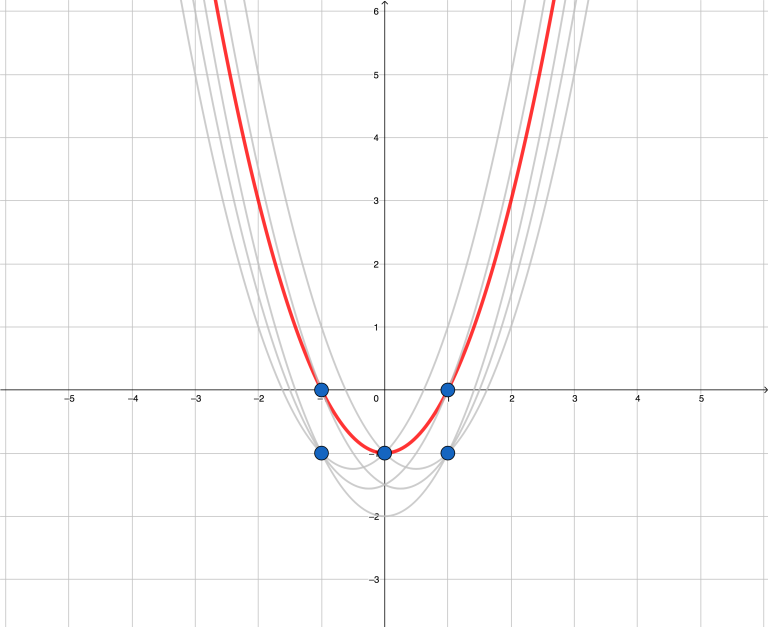

# 2954 几何

## 题目描述

平面直角坐标系内有 $$n$$ 个点，你想知道有多少曲线 $$y = x^2 + bx + c$$ 经过其中的至少两个点，而且没有任何点在它的上方。

## 输入格式

第一行一个整数 $$n$$，表示点数。

接下来 $$n$$ 行，每行两个整数 $$x,\,y$$ 表示表示一个点 $$(x,\,y)$$。

## 输出格式

输出一行一个整数表示答案。

## 输入样例 1



```text
3
-1 0
0 2
1 0
```



## 输出样例 1



```text
2
```



## 输入样例 2



```text
5
1 0
1 -1
0 -1
-1 0
-1 -1
```



## 输出样例 2



```text
1
```



## 样例解释

### 样例 1



### 样例 2



## 数据范围

对于所有数据，满足 $$-10^6 \leq x,\,y \leq 10^6$$

对于 30% 的数据，满足 $$1 \leq n \leq 300$$

对于 60% 的数据，满足 $$1 \leq n \leq 1000$$

对于另外 10% 的数据，保证 $$y = 0$$

对于 100% 的数据，满足 $$1 \leq n \leq 2 \times 10^5$$

